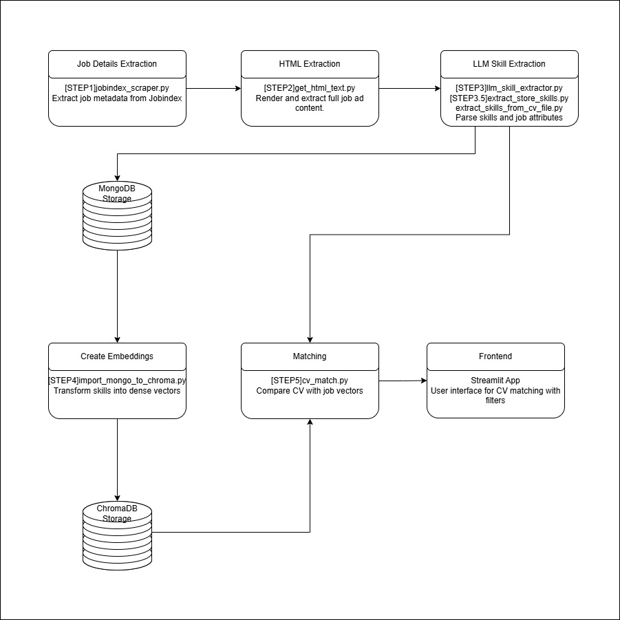

# 🇩🇰 CV Job Matcher for Denmark

🚀 [**Try the App**](https://huggingface.co/spaces/Krepselis/CV_Evalutaor_Job_Suggestions)  
📊 [**View System Status Dashboard**](https://huggingface.co/spaces/Tryfonas/CV_Evaluator_Health_Check) 

An AI-powered application that matches CVs with relevant job postings in Denmark by analyzing skills, experience, and job requirements using advanced natural language processing.



## 📋 Project Overview
...


CV Job Matcher is a complete MLOps pipeline that helps job seekers in Denmark find relevant positions based on their qualifications. The system:

1. Scrapes job listings from Danish job sites
2. Processes and analyzes job descriptions
3. Extracts skills and requirements using LLMs
4. Stores job data in MongoDB and ChromaDB vector database
5. Provides a Streamlit web interface for CV evaluation and job matching
6. Generates customized cover letters for targeted jobs

## 🚀 System Architecture

The system is organized as a pipeline with multiple steps:

### Data Collection & Processing
- **[STEP1]jobindex_scraper.py**: Collects job listings from Jobindex
- **[STEP2]get_html_text.py**: Extracts and cleans text from HTML job descriptions
- **[STEP3.5]extract_store_skills.py**: Extracts job skills/requirements using LLM
- **[STEP4]import_mongo_to_chroma.py**: Indexes processed jobs in ChromaDB for vector search

### Maintenance Scripts
- **[LOOP]jobindex_scraper_CHECK.py**: Updates active/inactive job statuses
- **[LOOP]_backup_mongo.py**: Creates database backups
- **[LOOP]_delete_inactive_jobs.py**: Cleans up old job listings

### CV Processing & Matching
- **extract_skills_from_cv_file.py**: Extracts skills from user CVs
- **cv_match.py**: Performs vector similarity matching between CVs and jobs
- **cover_letter_generator.py**: Generates tailored cover letters

### Web Interface
- **app/app.py**: Streamlit application for user interaction

## ⚙️ How It Works

The system leverages advanced natural language processing for CV-job matching:

1. **Skill Extraction**: 
   - Automatically identifies skills, experience levels, and qualifications from CVs and job listings
   - Uses language models to understand both explicit and implicit skills

2. **Multi-Dimensional Matching**: 
   - Creates embeddings for individual skills and complete documents
   - Performs vector similarity search to find matching jobs
   - Uses bidirectional alignment to understand skill importance and relevance

3. **Smart Filtering**: 
   - Filter jobs by location within Denmark
   - Filter by job category or industry
   - Filter by required languages (Danish, English, etc.)

4. **Cover Letter Generation**: 
   - Creates personalized cover letters using AI
   - Tailors content to highlight relevant skills for specific jobs


### Installation

1. Clone the repository:
   ```
   git clone https://github.com/yourusername/CV_Evaluator_Job_Suggestions.git
   cd CV_Evaluator_Job_Suggestions
   ```

2. Install required packages:
   ```
   pip install -r requirements.txt
   ```

3. Configure environment variables:
   Create a `.env` file with the following variables:
   ```
   # MongoDB Configuration
   MONGO_URI=""
   MONGO_DB_NAME=
   MONGO_COLLECTION=

   # ChromaDB Configuration
   CHROMA_HOST=your_chroma_host
   CHROMA_PORT=8000
   CHROMA_COLLECTION=job_embeddings

   # Model Configuration
   MODEL_NAME=paraphrase-multilingual-mpnet-base-v2
   TOP_N_RESULTS=10
   BATCH_SIZE=10

   # Jobindex Configuration
   JOBINDEX_BASE_URL=https://www.jobindex.dk/jobsoegning.json
   JOB_AGE_PARAM=jobage=1

   # Backup Configuration
   DAILY_RETENTION=7
   WEEKLY_RETENTION=4
   MONTHLY_RETENTION=6

   # Scraper Settings
   MAX_CONCURRENT=20
   PAGE_TIMEOUT=10000
   HTML_CHUNK_SIZE=4000

   # LLM API Configuration
   CUSTOM_LLM_API_URL=""
   CUSTOM_LLM_MODEL_NAME="gemma3:27b"
   
   # Embedding API Configuration
   USE_REMOTE_EMBEDDING=true
   EMBEDDING_API_URL=
   
   # OpenAI (optional fallback)
   OPENAI_API_KEY=your_openai_api_key
   
   # Security
   VERIFY_SSL=false
   ```


## 🌐 Deployment Architecture

The system implements a microservices architecture with multiple APIs and services:

1. **MongoDB Database**
   - Hosted on MongoDB Atlas cloud service
   - Stores structured job data, user profiles, and application history
   - Connection established via environment variables in the `.env` file

2. **ChromaDB Vector Database** 
   - Self-hosted on a dedicated server
   - Runs in a Docker container with persistent storage
   - Stores vector embeddings for semantic search capabilities

3. **LLM API Service**
   - Hosted on a dedicated server running Gemma 3 27B model
   - Custom API endpoint for:
     - Skill extraction from job descriptions and CVs
     - Contextual job matching refinement
   - Authentication handled via API keys in environment variables
   - Provides lower latency and higher throughput than cloud-based alternatives
   - Fully controlled inference parameters for task-specific optimization

4. **Streamlit Web Application**
   - Hosted on Streamlit Cloud
   - Provides user-facing interface for all functionality
   - Interacts with other services via REST APIs
   - Available at `https://huggingface.co/spaces/Krepselis/CV_Evalutaor_Job_Suggestions`

5. **Data Pipeline Services**
   - Job scraping workers run on scheduled cron jobs
   - Data processing pipeline executes on serverless functions
   - Database maintenance scripts run on VM instances

## 📊 System Integration

The services communicate through the following integration patterns:

1. **CV Processing Flow**
   - Client uploads CV to Streamlit frontend
   - Frontend sends document to skill extraction service
   - LLM API processes and extracts structured skills
   - Vector representations created and stored temporarily
   - Job matching service performs similarity search against ChromaDB
   - Results returned and displayed in frontend interface

2. **Job Data Collection Flow**
   - Scraper services collect job listings on schedule
   - Raw HTML stored temporarily in MongoDB
   - Processing service extracts clean text and metadata
   - LLM service identifies and categorizes skills/requirements
   - Vector embeddings generated and stored in ChromaDB
   - Status tracking updates MongoDB collection

3. **Cover Letter Generation Flow**
   - User selects job match in frontend
   - Request sent to cover letter service with CV and job details
   - LLM API generates personalized content
   - Result returned to frontend for user editing/download

## 📊 Pipeline Execution

To run the complete data pipeline:

1. Scrape job listings:
   ```
   python src/[STEP1]jobindex_scraper.py
   ```

2. Extract HTML content:
   ```
   python src/[STEP2]get_html_text.py
   ```

3. Extract skills from job descriptions:
   ```
   python src/[STEP3.5]extract_store_skills.py
   ```

4. Import to vector database (From MongoDB to ChromaDB):
   ```
   python src/[STEP4]import_mongo_to_chroma.py
   ```

5. Update active job statuses (run periodically):
   ```
   python src/[LOOP]jobindex_scraper_CHECK.py
   ```


## 👥 Contributors

- **Alexandros Maniatis** - [GitHub](https://github.com/Krepseliss)
- **Lauris Piziks** -  [GitHub](https://github.com/Lpiziks2)
- **Tryfonas Karmiris** - [GitHub](https://github.com/trifon-git)


This project was developed as part of the Second Semester Projects course at Aalborg University.

